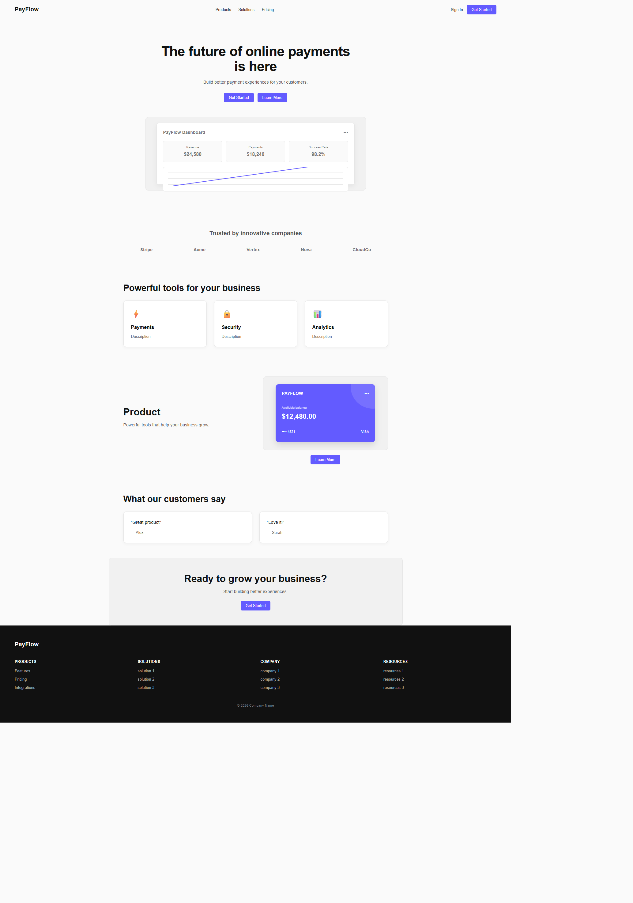
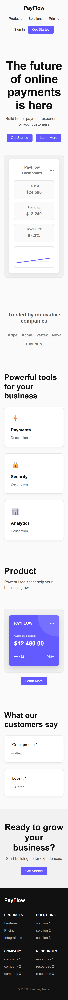

# Company Website Clone

A responsive company website landing page built from scratch using **HTML5 and CSS3**. This project focuses on building a complete multi-section website, practicing modern CSS layouts, responsive design, visual components, and accessibility-focused interaction states.

## 🚀 Live Demo

Coming soon.

## 📸 Screenshots

### Desktop



### Mobile



## ✨ Features

- Responsive navigation bar
- Hero section with call-to-action buttons
- Custom dashboard visual built with HTML and CSS
- Company trust/logo section
- Feature cards
- Product section with custom payment card visual
- Customer testimonials
- Call-to-action section
- Responsive footer
- Hover states
- Keyboard focus states
- Responsive layouts for desktop, tablet, and mobile screens

## 🛠️ Built With

- HTML5
- CSS3
- Flexbox
- CSS Grid
- Media Queries
- CSS Transitions
- CSS Transforms
- Pseudo-elements
- Responsive Design

## 📁 Project Structure

```text
company-website-clone/
├── assets/
│   ├── desktop-preview.png
│   └── mobile-preview.png
├── index.html
├── style.css
└── README.md
```

## 📚 Lessons Learned

- Practiced building a complete multi-section webpage from scratch.
- Improved my understanding of Flexbox and CSS Grid for page layouts.
- Practiced responsive design using media queries.
- Learned to structure reusable visual components using HTML and CSS.
- Practiced CSS positioning, stacking, overflow, and pseudo-elements.
- Improved my understanding of responsive cards and dashboard layouts.
- Practiced hover and keyboard focus states.
- Practiced building visual UI components without relying on image assets.
- Improved my ability to organize a larger HTML/CSS project.
- Practiced using Git throughout the development process.
- Practiced making meaningful commits and publishing a local repository to GitHub.

## 🔮 Future Improvements

- Add real navigation destinations.
- Add JavaScript interactions.
- Replace placeholder content with realistic company content.
- Add a real chart/data visualization.
- Improve accessibility further.
- Add form functionality if needed.
- Deploy the project as a live website.

## 👨‍💻 Author

**SK Tawfiq Hasib**

## 📄 License

No license has been added yet.

## 🔗 GitHub Repository

This project is available on GitHub.
